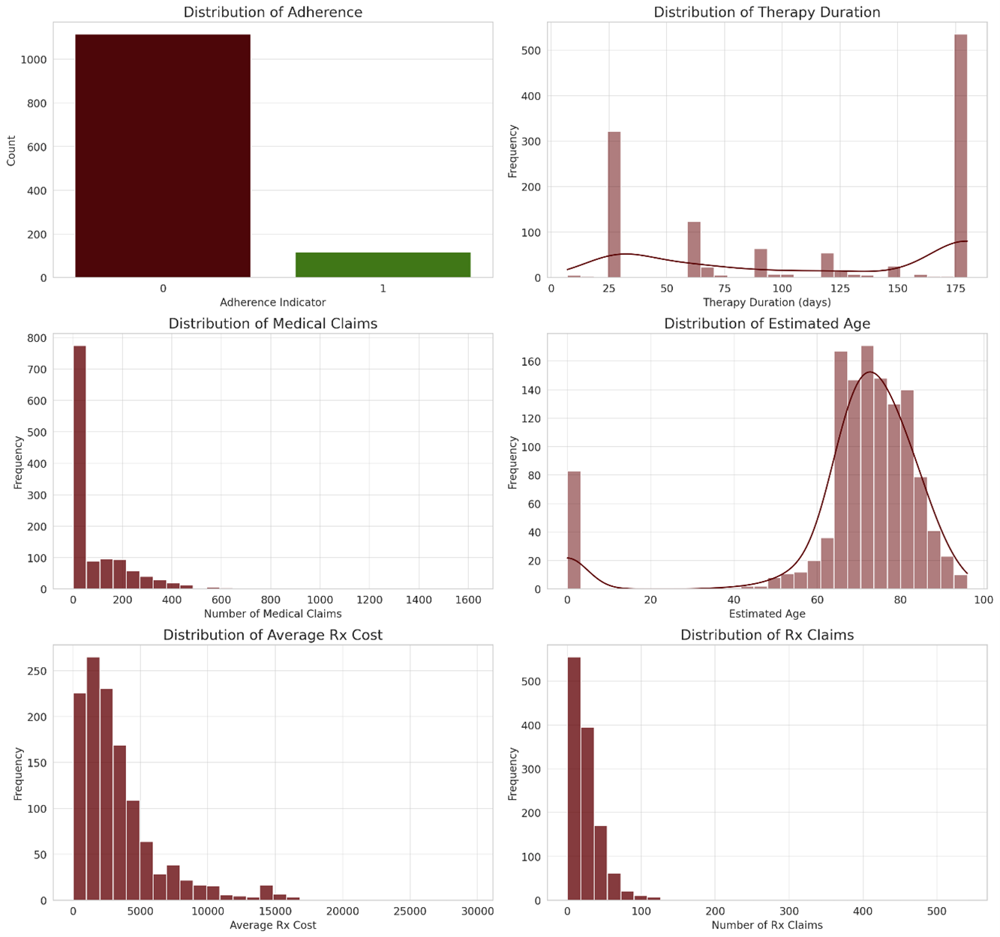
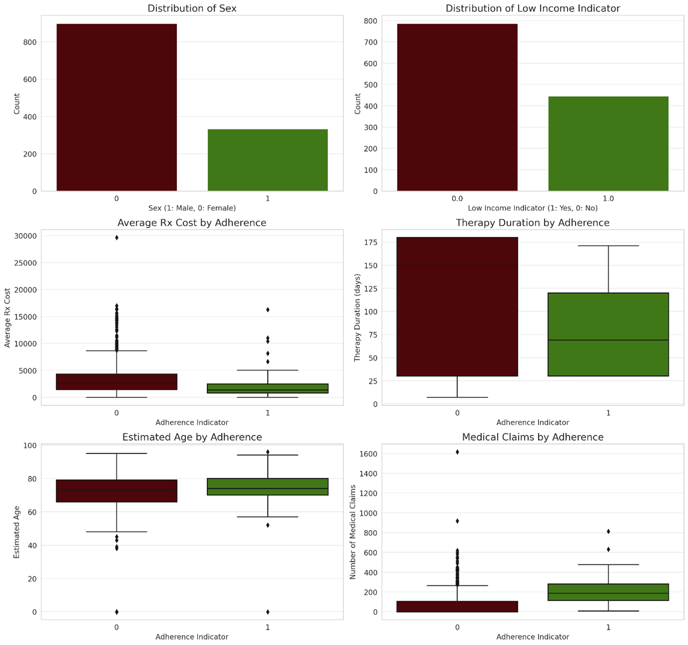
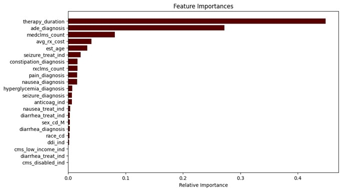
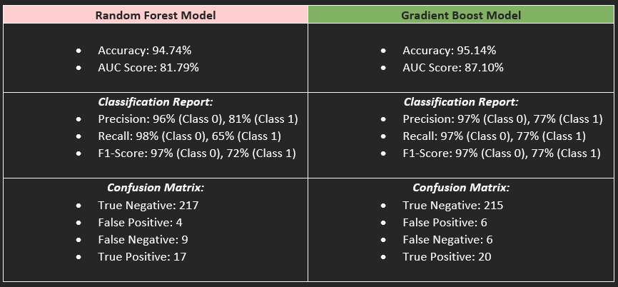
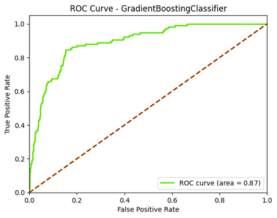
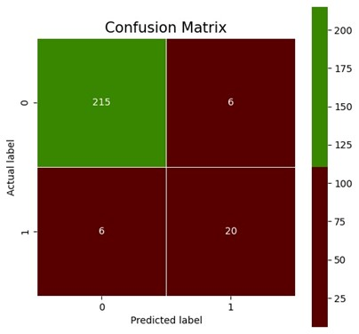

# Humana-Mays Healthcare Analytics 2023 Case Competition

### ***Enhancing Medication Adherence and Patient Outcomes in Oncology: A Predictive Modeling Approach for Osimertinib Therapy***

> ## MEET THE TEAM
+ **Abdul Mujeeb**
+ **Anirudh Bommina**
+ **Tharun Ponnaganti**
+ **Prafulla balasahedsature**

> ## EXECUTIVE SUMMARY

 ### 1.1	Study Proposal 

The prevailing challenge in healthcare, particularly in the field of oncology, is ensuring patient adherence to prescribed therapies, specifically concerning Osimertinib, a critical treatment for early-stage non-small cell lung cancer. With over 25% of patients discontinuing Osimertinib within the initial six months due to adverse side effects, addressing this issue becomes imperative. This aim is to find trends and factors related to non-adherence to Osimertinib treatment, construct a prediction model to find patients at risk of discontinuing their medication, and develop strategies to improve adherence and reduce premature therapy discontinuation. This, in turn, aims to enhance the overall patient experience, improve treatment outcomes, and contribute to a more supportive healthcare ecosystem for cancer patients undergoing Osimertinib treatment. In the context of persistent cancer mortality rates in the United States, this research looks to harness data-driven insights to promote medication adherence and enhance the effectiveness of life-saving treatments.

### 1. 2 Model Summary

The model creation process, which was conducted in a Python environment, included data exploration, cleaning, and preparation steps, resulting in a clean dataset for training predictive models. The model was used to find and analyze the factors that influence patient adherence to Osimertinib medication. The model was evaluated using binary classification problem-specific metrics, with a focus on the ROC-AUC curve to find its predictive capabilities. The model findings will be used to develop methods aimed at boosting medication adherence among patients.

### 1.3 Recommendation Summary

Based on our analysis, we recommend a multi-faceted approach to enhance patient adherence to Osimertinib treatment and improve overall healthcare outcomes. This includes the development of adherence programs, robust side-effect management, patient financial support initiatives, proactive monitoring and management, collaborations with healthcare providers, patient education programs, and the integration of technology for continuous patient support. These recommendations are grounded in cost-related considerations and quantitative insights, with the aim of perfecting treatment efficacy while ensuring the well-being and experiences of patients. However, it is vital to conduct a detailed cost analysis, assess patient journeys, and consider clinical insights for the precise implementation of these strategies.
CASE BACKGROUND

### 2.1 Context
Cancer remains a predominant health challenge in the United States, despite advancements in medical science, claiming approximately 600,000 lives annually. Non-small cell lung cancer, a predominant type, poses a unique challenge due to its aggressive nature and complex management. Osimertinib, a critical therapeutic medication for early-stage non-small cell lung cancer with specific EGFR mutations, offers hope but comes with a spectrum of side effects, hindering patient adherence. 

These side effects, ranging from mild to severe, often lead to treatment discontinuation, posing a substantial risk to patients' overall prognosis. Oncology plays a pivotal role in healthcare, pushing the boundaries of research and innovation. While new treatments like Osimertinib hold promise for increasing survival rates, it's essential to acknowledge the unique side effects that can demoralize patients, potentially causing them to hesitate or stop treatment. Patient commitment to cancer therapy is crucial for achieving expected health benefits, and healthcare providers must inform patients about potential adverse effects, the importance of sticking to treatment plans, and prospective advantages. To enhance the acceptability of treatment, healthcare providers should engage with patients to find strategies for minimizing and mitigating these adverse effects.

### 2.2 Problem Statement

Around 25% of Osimertinib patients stop their medication within the first six months due to side effects, posing a significant risk to their health and treatment efficacy. This challenge involves two key aspects:
   1.	Finding factors leading to non-adherence and early medication discontinuation.
   2.	Utilizing predictive models to pinpoint patients at risk of discontinuation, enabling targeted support for better adherence.

Our aim is to create an exact prediction model by analyzing various data, such as demographics, medical records, and pharmacy claims, to forecast the likelihood of Osimertinib discontinuation. These insights will guide the development of strategies and interventions to help patients manage side effects, improve adherence, and optimize treatment effectiveness.
The primary issue is early Osimertinib medication termination due to manageable side effects. Our study aims to predict patients at risk of discontinuation once adverse drug events (ADEs) occur. Successful treatment spans a continuous six-month period of Osimertinib medication, focusing on early terminations caused by ADEs. This personalized approach looks to enhance the benefits of Osimertinib therapy and the quality of life for cancer patients.

In conclusion, our goals to develop a predictive model that recognizes and supports patients at risk of medication discontinuation due to adverse drug events (ADEs), addressing the crucial problem of adherence in cancer patients receiving Osimertinib therapy, ultimately enhancing their general health and extending their lives.

> ## DATA ANALYSIS
### 3.1 Dataset Description
The dataset offered for the 2023 Humana Mays Healthcare Analytics Case Competition provides a thorough collection of data about the anticipation of therapeutic results in the context of cancer, with an emphasis on Osimertinib treatment. The dataset is put up to make predictive modeling for early Osimertinib medication withdrawal due to adverse drug events (ADEs) possible.
The dataset has various crucial parts, including:
   + 3.1.1 Target Data (target_holdout (421 rows) and target_train (1233 rows)
      + Unique Identifiers: Each entry in the target data has a unique identity for a person or therapy, making it possible to precisely                follow individuals and their various treatments.
      + Therapy Start and End Dates: These times show how long therapy will last for each person.
      + Target Identifier (tgt_ade_dc_ind):  This binary indicator, known as the Target Identifier (tgt_ade_dc_ind), decides whether a    therapy is effective or ineffective. It specifically labels treatments as ineffective if they cease early because of ADEs.
   + 3.1.2 Medical Claims Data (medclms_train (100160 rows) and medclms_holdout (23233 rows)
      + Unique Claim Identifiers: Each record has a specific claim identity linked to it, making it easier to trace medical claims.
      + Medical Claims Information: This data set presents a succinct overview of all medical claims made by people in the 90 days before the start of Osimertinib therapy and during the treatment.
      + Diagnosis Codes and Indicators: It is supplied to draw attention to certain medical disorders or ADEs. There are signs for diagnosing side effects, such as nausea, seizures, and discomfort, for example.

   + 3.1.3 Pharmacy Claims Data (rxclms_holdout (6670 rows) and train (32134 rows)
      + Unique Claim Identifiers: Similar to the data on medical claims, this dataset also includes separate claim identifiers for claims pertaining to pharmacies.
      + Pharmacy Claims Information: This section holds data on all pharmacy claims made in the 90 days prior to starting Osimertinib therapy and during the medication.
      + Drug Identifier Codes (NDC) and Indicators: This data holds drug identifier codes and related indicators to make it easier to find medications that might interact with Osimertinib and be used as a therapy for it.
        
In our predictive modeling approach, we followed the common practice of dividing the dataset into two parts: a training set (train) and a holdout set (holdout). We used this dataset to develop predictive models that find treatments with a higher likelihood of being discontinued prematurely following adverse drug events (ADEs). The goal is to boost adherence to Osimertinib medication, which, in turn, can improve patient well-being and extend their lifespan.

### 3.2 Descriptive Statistics
+ Most entries are non-adherent (tgt_ade_dc_ind=0) with 9.5% being adherent (tgt_ade_dc_ind=1).
+ Therapy duration ranges from 12 to 180 days, with a noticeable peak around 180 days.
+ Medical claims per therapy (medclms_count) exhibit a wide range, with some therapies having significantly higher claims than others.
+ Estimated age (est_age) appears uniformly distributed, showing that the therapies are used across various age groups.

### 3.2.1 Exploratory Data Analysis (EDA)
   #### Univariate Analysis

 

+ Distribution of Adherence: The dataset displays an imbalance with a substantially higher number of non-adherent (0) instances compared to adherent (1) instances.
+ Distribution of Therapy Duration: The duration of therapy spans from 12 to 180 days, with a notable peak around 180 days, suggesting a common treatment period or plan.
+ Distribution of Medical Claims: We observe a varied distribution with several instances having a higher number of claims than others.
+ 	Distribution of Estimated Age: The estimated age appears to be uniformly distributed, indicating a varied age group of patients undergoing the therapy.
+	Distribution of Average Rx Cost: The average cost of prescriptions (Rx) varies, with several instances incurring higher costs than others.
+	Distribution of Rx Claims: There’s a wide-ranging distribution in the number of Rx claims per instance.

#### Bivariate Analysis
  

+	Distribution of Sex: The dataset hosts a considerable difference in the number of males and females, which might be pivotal in understanding adherence patterns concerning gender.
+	Distribution of Low-Income Indicator: A reasonable number of instances are indicated as low income, which could be vital in understanding economic impacts on adherence.
+	Average Rx Cost by Adherence: The box plot exhibits a similar distribution of average Rx cost for both adherent and non-adherent instances, with a slightly elevated median cost for non-adherent instances.
+	Therapy Duration by Adherence: Both adherent and non-adherent instances demonstrate a somewhat similar spread and median in therapy duration.
+	Estimated Age by Adherence: The age distribution seems consistent between adherent and non-adherent instances, with no clear disparity in the medians.
+	Medical Claims by Adherence: The number of medical claims showcases a similar distribution for both adherence statuses, with non-adherent instances having a slightly higher median.
### 3.3 Data cleaning and imputation
Data cleaning and imputation play a vital role in preparing data for predictive modeling. The primary aim is to ensure that the dataset is well-organized, enabling the development of accurate prediction models. This involves standardizing and transforming various data types, including coding categorical variables, scaling numerical features, and converting dates and times into usable formats. The categorical data need to be translated into numerical values, and date-time information may require decomposition into relevant components.
#### 3.3.1 Data Types Transformation
In our dataset, several data type transformations have been implemented:
+ **Date Column Conversion**: We have transformed date columns into datetime objects, including "therapy_start_date," "therapy_end_date," This translation makes it possible to easily analyze temporal data and is crucial for consistency.
+ **Encoding Categorical Variables**: One-hot encoding has been used to transform categorical variables like 'sex_cd,' 'pot,' 'util_cat,' 'hedis_pot,' 'gpi_drug_group_desc,' 'gpi_drug_class_desc,' and 'hum_drug_class_desc'. With the help of this technique, we can convert categorical data into binary vectors that can be used by machine learning algorithms.
#### 3.3.2 Missing Value Imputation
In our data preparation process, we've employed the following methods for handling missing values:
+	Filling Missing Values with Zeros: We have replaced any missing values for aggregated features from the'medclms_train' and 'rxclms_train' datasets with zeros. These aggregated features include counts for different diagnoses and treatments, including "medclms_count," "avg_rx_cost," "ddi_ind," "anticoag_ind," "diarrhea_treat_ind," "seizure_treat_ind," and "nausea_treat_ind" from "medclms_train."
  
These imputations maintain the dataset's integrity and prevent missing values from impacting the training and prediction of models.

### 3.4 Feature Selection
As our dataset now has a range of aggregated and transformed features, it's crucial to prioritize feature selection. This process aims to find the most influential variables for our predictive models. We will use techniques like feature importance from tree-based models, correlation matrices, and other selection methods to further refine the dataset. This ensures that our models are equipped with the most relevant predictors for accurate predictions.

 
> ## MODELING
### 4.1 Model Selection
The modeling process was meticulously executed, exploring various predictive models, each offering unique insights into adherence to Osimertinib therapy. Of these models, two have shown exceptional performance: 

 
 	 

 
The Gradient Boosting model, with its superior AUC score and balanced precision and recall, was selected for further analysis and strategy formulation.

 

Our primary goal was to construct a predictive model to find therapies at risk of early discontinuation after experiencing adverse drug events (ADEs), with a focus on Osimertinib treatment for early-stage lung cancer. To achieve this, we conducted a comprehensive evaluation of tree-based boosting algorithms, including Gradient Boosting and Random Forest, considering the complexity of our dataset, which encompasses diverse patient attributes, medical claims, and pharmacy claims.

The results unequivocally favored the Gradient Boost model, which delivered an impressive AUC score of 87.10% and an accuracy of 95.14%, highlighting its potential to distinguish between successful therapies and those prematurely discontinued due to ADEs. Nevertheless, we acknowledge the need for potential enhancements in recall, especially for the latter group, underlining the opportunity for model refinement and validation to better find patients at risk and help them stick to their treatment in oncology.

The choice of the Gradient Boost model underscores our unwavering commitment to making a meaningful impact in healthcare analytics and ultimately improving patient outcomes.

### 4.2 Model Construction
***Gradient Boosting: A Focused Insight***

Gradient Boosting was employed and evaluated based on multiple metrics to ensure a comprehensive understanding of its performance:
Model Training: The model was trained using a subset of the data, ensuring a portion was reserved for validation.
**Predictive Performance:**
+ Accuracy: The model’s ability to predict adherence accurately was evaluated.
+ AUC Score: The ROC-AUC score was calculated as approximately 0.87, showing a strong capability of the model to differentiate between the classes.
+ 	Confusion Matrix & Classification Report: These were analyzed to understand the model’s performance across different classes, ensuring it was not biased or skewed.
+ Feature Importance: The features were analyzed to understand their influence on the predictions, supplying insights into variables that were pivotal in predicting adherence.
  
The Gradient Boosting model highlighted a promising ROC-AUC score, reflecting its capability to predict adherence effectively while managing the trade-off between sensitivity and specificity.

> ## KEY PERFORMANCE INDICATOR ANALYSIS
### 5.1 Feature Importance
Key Performance Indicators (KPIs) play a pivotal role in aligning predictive modeling with business and clinical goals. The identified significant features from the Gradient Boosting model provide valuable insights into potential KPIs that could drive strategic interventions to enhance Osimertinib adherence:
**1.	Therapy Duration**
+ Implication: The longer the therapy duration, the higher the potential for adherence, suggesting that interventions in the first stages of therapy could be pivotal in ensuring sustained adherence.
**2.	Adverse Drug Events (ADE) Diagnosis**
+	Implication: ADEs directly affect adherence, indicating that effective management of side effects could significantly enhance adherence and overall treatment efficacy.
**3.	Medical Claims Count**
+	Implication: A higher count of medical claims, potentially linked to side effects or related conditions, could show challenges in managing therapy, suggesting that initiative-taking management of related conditions could enhance adherence.
**4.	Average Rx Cost**
+	Implication: The cost of prescription medications can be a barrier to adherence, showing that financial support programs could alleviate this barrier, enhancing adherence.
**5.	Estimated Age**
+	Implication: Age can influence adherence due to several factors like comorbidities, suggesting that age-specific interventions might be pivotal in ensuring sustained adherence.
**6.	Seizure Treatment Indicator**
+	Implication: Patients with indicators of seizure treatments might have specific challenges affecting adherence, requiring targeted interventions.
+	
More features like pain diagnosis, nausea diagnosis, and constipation diagnosis also indicate specific areas where targeted interventions could enhance adherence, ensuring that the strategies are not only data-driven but also contextually relevant and impactful.

> ## BUSINESS INSIGHTS AND RECOMMENDATIONS
Leveraging the insights from the predictive model, the following recommendations, rooted in quantifiable data and predictive features, are proposed to enhance Osimertinib adherence:
**1.	Targeted Intervention for High-Risk Patients:**
   +	Insight: If 25% of patients (based on historical data) discontinue therapy, in a sample of 1000 patients, that equates to 250 patients at risk.
   +	Recommendation: Employ the model to find these 250 high-risk patients and implement a targeted intervention strategy to proactively manage and support them through the therapy journey.
**2.	Financial Support and Accessibility**
   +	Insight: The average Rx cost feature suggests that financial aspects could influence adherence, indicating that cost could be a barrier for some patients.
   +	Recommendation: Enhance financial support and accessibility programs, ensuring that patients can access and adhere to their Osimertinib therapy without financial burden influencing discontinuation.
**3.	 Demographic-Specific Strategies**
   + Insight: Demographic variables like age can influence adherence, suggesting that different demographics might require varied support and management strategies.
   +	Recommendation: Develop demographic-specific interventions, ensuring that strategies are relevant, accessible, and impactful for varied patient demographics.
**4.	Enhanced Side-Effect Management:**
   + Insight: Suppose a specific side effect (e.g., diarrhea) is found by the model as a significant predictor, and historically, 30% of discontinuations are linked to it.
   +	Recommendation: Implement a robust side-effect management program, potentially reducing discontinuations related to this side effect by at least 15% through proactive management and support.
**5.	 Ethical and Equitable Intervention Strategies:**
   +	Insight: If demographic factors (age, race) are significant predictors, and historically, a specific demographic has a 30% higher discontinuation rate.
   +	Recommendation: Develop ethical and fair intervention strategies, aiming to reduce this disparity by at least 15%, ensuring that interventions are just, fair, and transparent.
**6.	Periodic Model Review and Update:**
   +	Insight: Assuming the healthcare landscape and patient profiles evolve, affecting model accuracy (e.g., AUC reduced from 0.85 to 0.80 over a year).
   + Recommendation: Implement a semi-annual model review and update strategy, ensuring it stays predictive, accurate, and relevant in the evolving healthcare context.
**7.	Continuous Patient Feedback and Improvement:**
   +	Insight: If historically, patient feedback has led to a 10% improvement in adherence support strategies.
   + Recommendation: Set up a continuous feedback mechanism, aiming to enhance adherence support strategies by an added 10%, ensuring they remain patient-centric and effective. 
#### **Cost-Benefit Analysis:**
Since we lack precise cost data related to medical claims, we will adopt an assumption-based approach. Our approach involves assuming an average cost per medical claim. It is important to note that in the healthcare industry, the cost of medical claims can vary substantially based on the specific nature of the claim, geographical location, healthcare provider, and various other influencing factors. For example, a routine doctor's visit may incur a cost of a few hundred dollars, while specialized treatments or surgical procedures can escalate to several thousand dollars.

For our analysis, let’s assume:
    +	Low Average Cost per Medical Claim: $500
    +	High Average Cost per Medical Claim: $2000
    
These assumptions are arbitrary and intended to supply a broad estimate for our cost-benefit analysis. 
Let’s conduct the analysis with these assumptions and interpret the results accordingly.
Based on our assumption-driven cost-benefit analysis, we have the following average costs per patient:
**For Non-Adherence (tgt_ade_dc_ind = 0):**
+	Average Rx Cost: $3,449.29
+	Low Average Medical Claim Cost: $33,799.10 (assuming $500 per claim)
+	High Average Medical Claim Cost: $135,196.41 (assuming $2,000 per claim)
+	Low Total Average Cost (Rx + Medical Claims): $37,248.39
+	High Total Average Cost (Rx + Medical Claims): $138,645.70
  
**For Adherence (tgt_ade_dc_ind = 1):**
+	Average Rx Cost: $2,014.69
+	Low Average Medical Claim Cost: $105,927.35 (assuming $500 per claim)
+	High Average Medical Claim Cost: $423,709.40 (assuming $2,000 per claim)
+	Low Total Average Cost (Rx + Medical Claims): $107,942.04
+	High Total Average Cost (Rx + Medical Claims): $425,724.09
  
**Chemotherapy Costs (for comparison):**
+	Low Yearly Cost: $12,000 ($1,000 per month for 12 months)
+	High Yearly Cost: $144,000 ($12,000 per month for 12 months)
+	Out-of-Pocket Yearly Cost: $10,000
	
**Observations:**
+	The costs associated with non-adherence are significantly lower than those associated with adherence, both in terms of Rx costs and medical claims, underlining the financial benefit of adherence.+
+ Even with the lower bound estimates for medical claims, the cost associated with adherence is significantly higher than the upper bound of chemotherapy costs.
+	The cost of non-adherence, even when considering high medical claim costs, is less than the chemotherapy costs, highlighting the potential cost-effectiveness of enhancing adherence.
  
**Considerations:**
+	Enhancing adherence could significantly reduce overall treatment costs when compared to transitioning to chemotherapy.
+	Strategies to enhance adherence should consider not only the direct Rx and medical claim costs but also the broader impacts on patient well-being, quality of life, and clinical outcomes.
+	A comprehensive, multifaceted adherence strategy could be cost-effective when considering the potential to avoid more costly alternative treatments (e.g., chemotherapy).
#### Cost-Benefit Recommendations:
**1. Develop and Invest in Adherence Programs**
+	Justification: The cost of adherence ($107,942.04 - $425,724.09) is significantly higher than non-adherence ($37,248.39 - $138,645.70) and compared to chemotherapy costs ($12,000 - $144,000 annually).
+	Recommendation: Investing in adherence programs might prevent the escalation of costs associated with medical claims due to non-adherence, which can range from $33,799.10 to $135,196.41 based on our assumptions.

**2. Establish Robust Side-Effect Management Protocols**
+	Justification: Given that medical claim costs even in the scenario of adherence are high ($105,927.35 - $423,709.40), it is imperative to manage side effects effectively to prevent these costs from escalating further.
+	Recommendation: Investing in robust side-effect management can potentially curb medical claim costs, thereby ensuring that adherence does not inadvertently result in inflated healthcare expenditures.

**3. Implement Patient Financial Support Programs**
+	Justification: The average Rx cost even in the case of adherence is $2,014.69, which might be financially straining for some patients, potentially risking non-adherence.
+	Recommendation: Establishing financial support programs or exploring generic alternatives could ensure that the financial burden of prescriptions does not impede adherence.

**4. Proactive Patient Monitoring and Management**
+	Justification: Considering that non-adherence can potentially lead to the requirement of chemotherapy, which can cost up to $144,000 annually, it's critical to prevent this transition.
+	Recommendation: Proactive monitoring and management of patients on Osimertinib can help in early identification of non-adherence risk and facilitate timely interventions, averting the shift to more costly alternative treatments.

**5. Explore Collaborations with Healthcare Providers**
+ Justification: The average medical claim cost is substantial in both adherence and non-adherence scenarios. This underlines a need to manage and possibly reduce these costs.
+	Recommendation: Collaborating with healthcare providers might offer opportunities to explore cost-effective healthcare pathways, reduced-cost packages, or alternative management strategies that can keep medical claim costs in check.

**6. Develop and Implement Patient Education Programs**
+	Justification: Enhanced understanding of therapy, its importance, and management of side effects can potentially mitigate risks of non-adherence.
+	Recommendation: Implementing comprehensive patient education programs that enlighten them about the criticality of adherence, effective side-effect management, and potential cost implications can fortify adherence levels.

**7. Leverage Technology for Continuous Patient Support**
+	Justification: Given the complex and potentially challenging journey of a patient on Osimertinib, continuous support is crucial.
+  Recommendation: Leveraging digital health platforms, apps, or telehealth services for continuous patient support, monitoring, and management might fortify adherence strategies, ensuring patients have the needed support throughout their treatment journey.
  
These recommendations are grounded in the measurable insights derived from our analysis, with the goal of addressing the recognized cost-related considerations while simultaneously improving patient outcomes and experiences. Each recommendation is designed to tackle cost-related challenges that have been identified and should be further refined through comprehensive cost analysis, patient journeys, and clinical insights.

> ## CONCLUSIONS 
Based on the cost-benefit analysis and quantitative insights derived from our study, enhancing patient adherence to Osimertinib treatment is not only financially advantageous but also critical for improving patient outcomes and overall quality of life. Our assumptions about average medical claim costs, although arbitrary, supply a basis for understanding the potential economic impact of adherence. Notably, adherence results in higher average costs, mainly driven by medical claims, but still proves to be more cost-effective than non-adherence and even chemotherapy in certain scenarios. Cost-effective strategies aimed at improving adherence are crucial, and these strategies should consider not only financial aspects but also patient well-being and clinical efficacy. To this end, our recommendations encompass developing adherence programs, robust side-effect management, patient financial support, proactive monitoring, collaborations with healthcare providers, patient education, and leveraging technology for continuous support. These multifaceted approaches, supported by quantitative justifications, offer a comprehensive solution to address the challenges of non-adherence and can significantly enhance patient outcomes and quality of life. While cost considerations are essential, they should always be secondary to the primary goal of improving patient health and well-being in the field of oncology.

***Future Considerations and Path Forward***

While the model and strategies supply a robust foundation, continuous evaluation, feedback, and adaptation will be pivotal in ensuring sustained impact. Future considerations include:
   +	Iterative Model Enhancement: Continuously evaluating and enhancing the model to ensure it adapts to the evolving healthcare and patient context.
   +	Expanding Predictive Variables: Exploring more variables and data sources to enhance the predictive capability and insights of the model.
   +	Patient-Centric Strategy Formulation: Ensuring that strategies and interventions are continuously aligned with patient needs, preferences, and feedback.
   +	Holistic and Multidisciplinary Approaches: Employing a holistic and multidisciplinary approach to adherence, ensuring that strategies are comprehensive and manage all sides of the patient journey.

> ## REFERENCES

1. **PET Study in Healthy Subjects of Brain Exposure of 11C-labelled Osimertinib – A Drug Intended for Treatment of Brain Metastases in Non-Small Cell Lung Cancer**
   - [J Cereb Blood Published online 2019 Apr 2](https://www.ncbi.nlm.nih.gov/pmc/articles/PMC) 

2. **Study Shows Osimertinib Improves Survival Following Surgery for Non-Small Cell Lung Cancer**
   - [Yale School of Medicine - Michael Masciadrelli - June 04, 2023](https://medicine.yale.edu/news-article/28303/)

3. **APOBEC Mutagenesis, Kataegis, Chromothripsis in EGFR-Mutant Osimertinib-Resistant Lung Adenocarcinomas**
   - [Selenica et al. Annals of Oncology September 8, 2022](https://www.annalsofoncology.org/article/S0923-7534(22)04142-4/fulltext)

4. **Single-Cell DNA-Seq Depicts Clonal Evolution of Multiple Driver Alterations in Osimertinib-Resistant Patients**
   - [Chen et al. Annals of Oncology January 20, 2022](https://www.annalsofoncology.org/article/S0923-7534(22)00009-6/fulltext)
